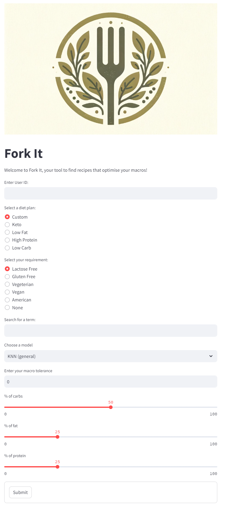

[![Contributors][contributors-shield]][contributors-url]
[![Forks][forks-shield]][forks-url]
[![Stargazers][stars-shield]][stars-url]
[![Issues][issues-shield]][issues-url]
[![MIT License][license-shield]][license-url]


<!-- PROJECT LOGO -->
<br />
<div align="center">
  <a href="https://github.com/kiliangone/fork-it">
    
  </a>

<h3 align="center">Fork it - Your individual recipe recommender </h3>

 <p align="center">
    Welcome to Fork it! This project aims to provide personalized recipe recommendations tailored to individual users' nutritional goals, ingredient preferences, and dietary restrictions. Leveraging collaborative filtering recommender systems along with Non-negative Matrix Factorization (NMF) and K-Nearest Neighbors (KNN) models, our system suggests recipes based on the user's rating history and specified criteria.
    <br />
    <a href="https://github.com/kiliangone/fork-it"><strong>Explore the docs »</strong></a>
    <br />
    <br />
    <a href="https://github.com/kiliangone/fork-it">View Demo</a>
    ·
    <a href="https://github.com/kiliangone/fork-it/issues">Report Bug</a>
    ·
    <a href="https://github.com/kiliangone/fork-it/issues">Request Feature</a>
  </p>
</div>

<!-- TABLE OF CONTENTS -->
<details>
  <summary>Table of Contents</summary>
  <ol>
    <li>
      <a href="#about-the-project">About The Project</a>
      <ul>
        <li><a href="#built-with">Built With</a></li>
      </ul>
    </li>
    <li>
      <a href="#getting-started">Getting Started</a>
      <ul>
        <li><a href="#prerequisites">Prerequisites</a></li>
        <li><a href="#installation">Installation</a></li>
      </ul>
    </li>
    <li><a href="#roadmap">Roadmap</a></li>
    <li><a href="#license">License</a></li>
    <li><a href="#contact">Contact</a></li>
  </ol>
</details>

## About The Project




<p align="right">(<a href="#readme-top">back to top</a>)</p>


<!-- GETTING STARTED -->
## Getting Started

To get a local copy up and running follow these simple example steps.

1. Clone the repo
2. Install packages
3. Download Data

### Clone the repo
```sh
   git clone https://github.com/kiliangone/fork-it.git
   ```

### Install packages

#### **`macOS`** type the following commands : 


- For installing the virtual environment and the required package you can either follow the commands:

    ```BASH
    pyenv local 3.11.3
    python -m venv .venv
    source .venv/bin/activate
    pip install --upgrade pip
    pip install -r requirements.txt
    ```

#### **`WindowsOS`** type the following commands :

- Install the virtual environment and the required packages by following commands.

   For `PowerShell` CLI :

    ```PowerShell
    pyenv local 3.11.3
    python -m venv .venv
    .venv\Scripts\Activate.ps1
    pip install --upgrade pip
    pip install -r requirements.txt
    ```

    For `Git-bash` CLI :
  
    ```BASH
    pyenv local 3.11.3
    python -m venv .venv
    source .venv/Scripts/activate
    pip install --upgrade pip
    pip install -r requirements.txt
    ```

    **`Note:`**
    If you encounter an error when trying to run `pip install --upgrade pip`, try using the following command:
    ```Bash
    python.exe -m pip install --upgrade pip
    ```

### Download Data

In order to use the repos' data you have to download the data stored in a google file. Please download the data you need from this <a href="https://drive.google.com/drive/folders/1L3fyzEDqe2Z7uzGZi3pD8EIVVvuyMSpR?usp=drive_link">file</a>.

<p align="right">(<a href="#readme-top">back to top</a>)</p>


<!-- ROADMAP -->
## Roadmap

As part of the project you can see our process in this <a href="https://miro.com/app/board/uXjVNy_D69k=/#tpicker-content">roadmap</a> or just see the pdf in the repo. We used Miro to plan what to do and how to it. 

<p align="right">(<a href="#readme-top">back to top</a>)</p>


<!-- LICENSE -->
## License

Distributed under the MIT License. See `LICENSE` for more information.

<p align="right">(<a href="#readme-top">back to top</a>)</p>


<!-- CONTACT -->
## Contact

Renata Mitrega - <a href="https://www.linkedin.com/in/renata-mitrega/">LinkedIn</a>

Richard James - <a href="https://www.linkedin.com/in/richard--james/">LinkedIn</a>

Kilian Gedat - <a href="https://www.linkedin.com/in/kiliangedatdata/">LinkedIn</a>


Project Link: [https://github.com/kiliangone/fork-it](https://github.com/kiliangone/fork-it)

<p align="right">(<a href="#readme-top">back to top</a>)</p>


<!-- MARKDOWN LINKS & IMAGES -->
<!-- https://www.markdownguide.org/basic-syntax/#reference-style-links -->
[contributors-shield]: https://img.shields.io/github/contributors/kiliangone/fork-it.svg?style=for-the-badge
[contributors-url]: https://github.com/kiliangone/fork-it/graphs/contributors
[forks-shield]: https://img.shields.io/github/forks/kiliangone/forkt-it.svg?style=for-the-badge
[forks-url]: https://github.com/kiliangone/fork-it/network/members
[stars-shield]: https://img.shields.io/github/stars/kiliangone/forkt-it.svg?style=for-the-badge
[stars-url]: https://github.com/kiliangone/fork-it/stargazers
[issues-shield]: https://img.shields.io/github/issues/kiliangone/forkt-it.svg?style=for-the-badge
[issues-url]: https://github.com/kiliangone/fork-it/issues
[license-shield]: https://img.shields.io/github/license/kiliangone/forkt-it.svg?style=for-the-badge
[license-url]: https://github.com/kiliangone/fork-it/blob/main/LICENSE
[product-screenshot]: images/screenshot.png

